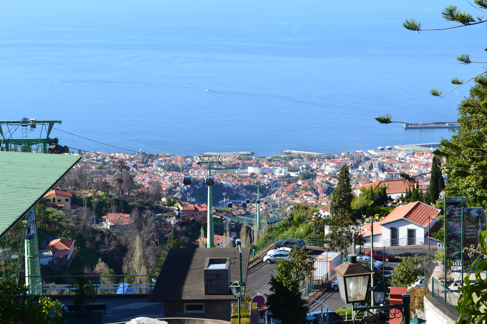

Und weil Sie nun schon die Güte haben, mich ein paar weitere Sätze lang zu begleiten, möchte ich diese Gelegenheit nutzen, Ihnen nicht nur als Lückenfüller zu dienen, sondern auf etwas hinzuweisen, das es ebenso verdient wahrgenommen zu werden: Webstandards nämlich.

Sehen Sie, Webstandards sind das Regelwerk, auf dem Webseiten aufbauen. So gibt es Regeln für HTML, CSS, JavaScript oder auch XML; Worte, die Sie vielleicht schon einmal von Ihrem Entwickler gehört haben.

Diese Standards sorgen dafür, dass alle Beteiligten aus einer Webseite den größten Nutzen ziehen.

Im Gegensatz zu früheren Webseiten müssen wir zum Beispiel nicht mehr zwei verschiedene Webseiten für den Internet Explorer und einen anderen Browser programmieren.

Es reicht eine Seite, die - richtig angelegt - sowohl auf verschiedenen Browsern im Netz funktioniert, aber ebenso gut für den Ausdruck oder die Darstellung auf einem Handy geeignet ist. Wohlgemerkt: Eine Seite für alle Formate.

Was für eine Erleichterung. Standards sparen Zeit bei den Entwicklungskosten und sorgen dafür, dass sich Webseiten später leichter pflegen lassen. Natürlich nur dann, wenn sich alle an diese Standards halten.

Das gilt für Browser wie Firefox, Opera, Safari und den Internet Explorer ebenso wie für die Darstellung in Handys. Und was können Sie für Standards tun? Fordern Sie von Ihren Designern und Programmieren einfach standardkonforme Webseiten. Ihr Budget wird es Ihnen auf Dauer danken. Ebenso möchte ich Ihnen dafür danken, dass Sie mich bis zum Ende gelesen

